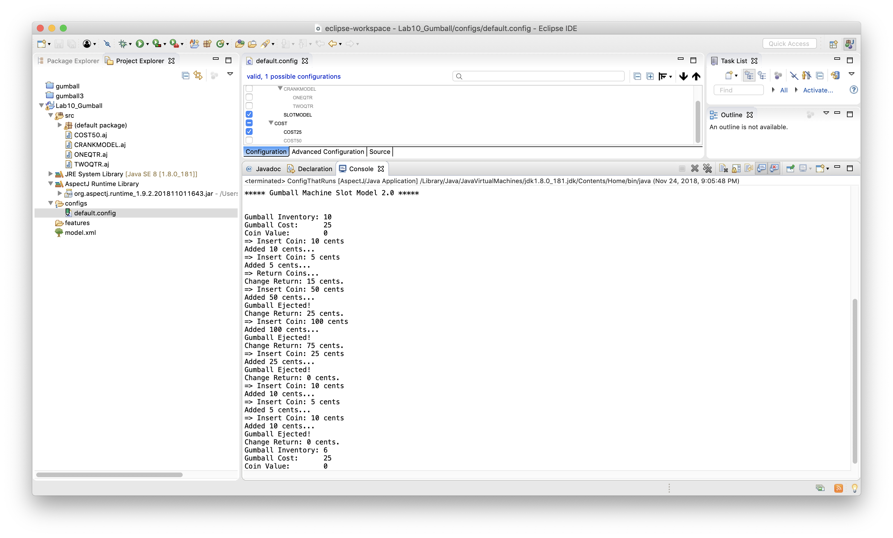
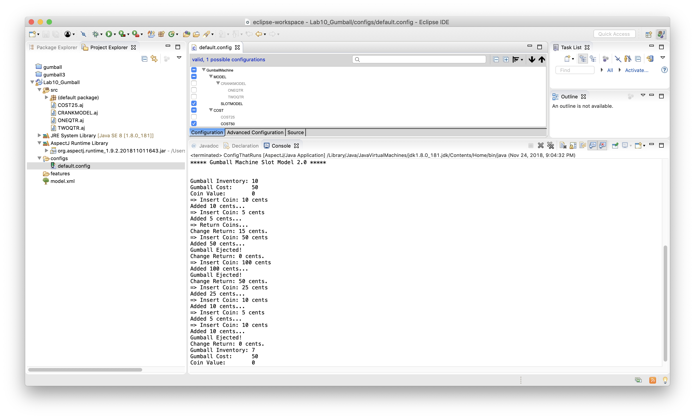
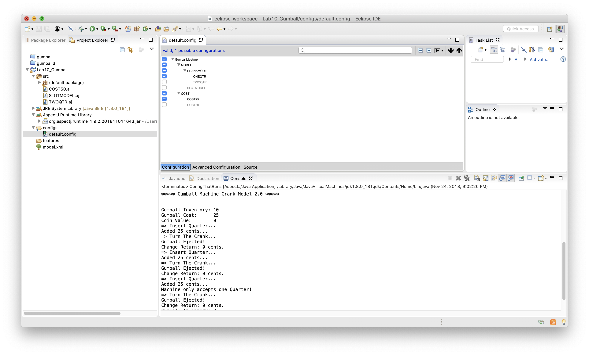
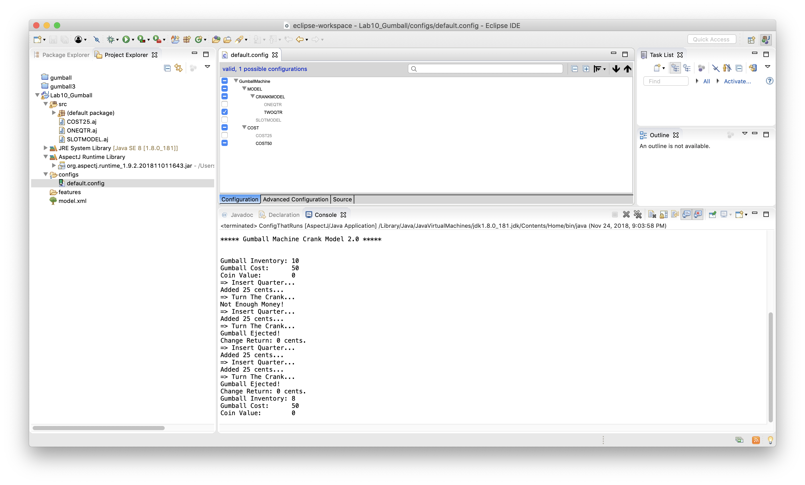

# CMPE 202 LAB-10

## Comparing Orignal and AspectJ implementation

In LAB1 created separate class for implementation of each type gumball machine accepting 25 Cents, 50 Cents and third to accept any coins. Based on the requirement we instantiated the respective class. Altering configuration of this machine required changes in the code since it is tightly coupled with code.
Whereas in LAB10 AspectJ implementation the configuration can be easily altered to get the required type of machine by making changes in configs file.

## Screenshots

1. Gumball Machine with model `SLOTMODEL` and cost `COST25`.

2. Gumball Machine with model `SLOTMODEL` and cost `COST50`.

3. Gumball Machine with model `CRANKMODEL` and cost `COST25` accepting `ONEQTR`.

4. Gumball Machine with model `CRANKMODEL` and cost `COST50` accepting `TWOQTR`.

